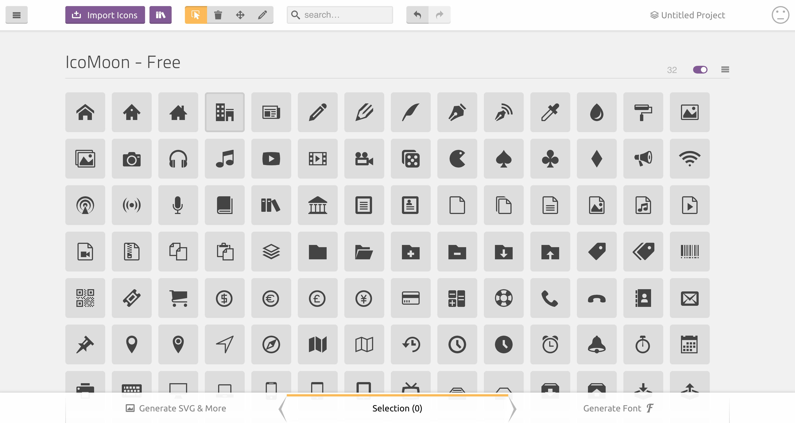
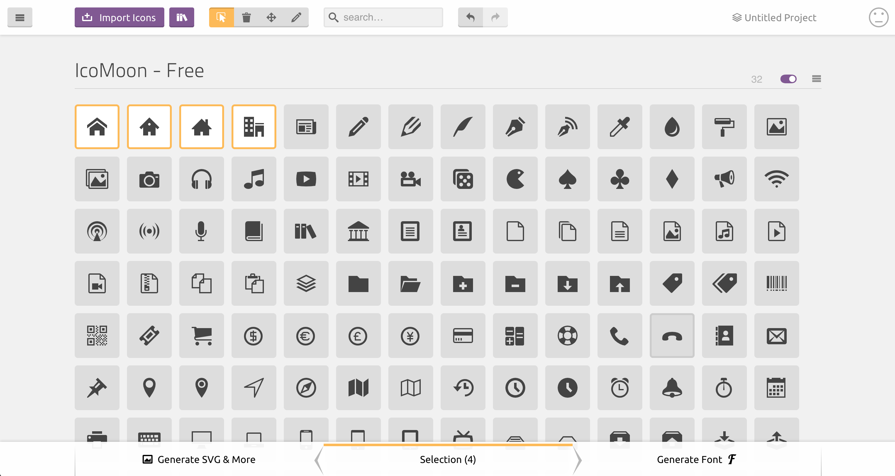
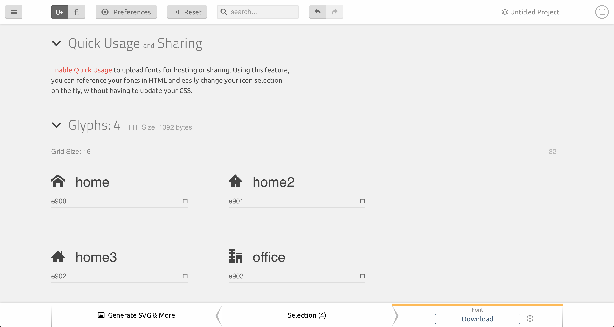
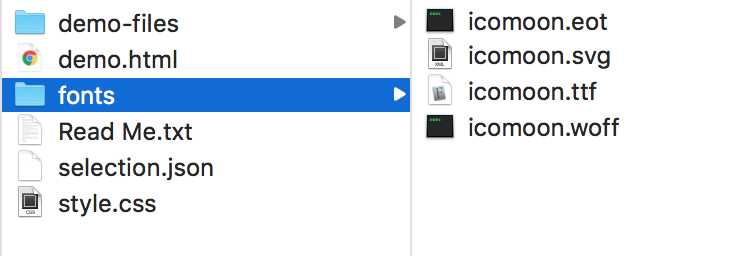
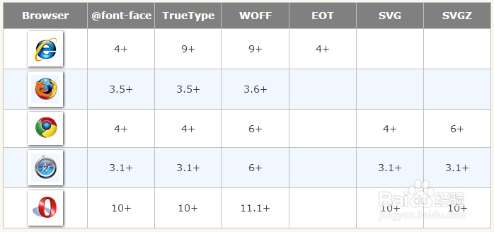

# 一次性搞定 Iconfont

<!-- TOC -->

- [一次性搞定 IconFont](#一次性搞定-iconfont)
  - [什么是 IconFont](#什么是-iconfont)
  - [IconFont 的背景](#iconfont-出现的背景)
  		- [WebFont](#Webfont)
  		- [Images](#Images)
  		- [CSS Sprites](#CSS-Sprites)
  		- [IconFont](#IconFont)
  - [IconFont 原理](IconFont-原理)
  - [IconFont 的优缺点](#iconfont-的优缺点)
    	- [优点](#优点)
    	- [不足](#不足)
  - [快速使用现有的 IconFont](#快速使用现有的-iconfont)
  - [创建自己的 IconFont](#创建自己的-iconfont)
  		- [使用软件生成](#使用软件生成)
    	- [使用网站生成](#使用网站生成)
    	- [使用脚本生成](#使用脚本生成)
    	- [.ttf、.eot、.woff 等字体文件](#ttfeotwoff-等字体文件)
  - [Reference](#Reference)

<!-- /TOC -->

## 什么是 IconFont

> 顾名思义，IconFont 就是字体图标。严格地说，就是一种字体，但是，它们不包含字母或数字，而是包含符号和字形。您可以使用 CSS 设置样式，就像设置常规文本一样，这使得 IconFont 成为 Web 开发时图标的热门选择。

## IconFont 的背景

### WebFont

> 我们都知道，在网页制作中，会经常用到不同的字体，常用的有 微软雅黑、宋体、Aria 等等。在我们写css的样式的时候，通过 font-family 可以指定元素的字体名称，**我们称这类字体为 WebFont**。但是传统的web开发人员的字体选择是有限的。只有少数几种字体可以保证在所有公共系统中都可以使用——这就是所谓的 Web-safe 字体。我们可以使用字体堆栈来指定可选择的字体，后面是Web-safe的替代选项，然后是默认的系统字体，但是为了确保我们的设计在每种字体中都可以使用，这增加了测试的开销。**Web字体是一种CSS特性，允许您指定在访问时随您的网站一起下载的字体文件。**首先，在CSS的开始处有一个@font-face块，它指定要下载的字体文件：
>
> ``` css
> @font-face {
>   font-family: "myFont";
>   src: url("myFont.ttf");
> }
> ```
>
> 然后我们就可以使用我们定义的字体了。
> 
> ``` css
>   html {
>  	  font-family: "myFont";
>	}
> ```

### Images

> 一个健全的网站，说不了各种图标，添加图标的传统方式就是图片，但是使用图片存在许多的弊端，主要表现是下面三个方面：
> 
> * 增加了页面的请求
> * 图片的大小和颜色不容易改变
> * 为了调高清晰度，图片越来越大

### CSS Sprites

> 为了减少图片请求数，提高性能，我们可能会使用雪碧图：**把网页中比较小的一些小图片整合到一张图片文件中，再利用 CSS 的 background-image 属性插入图片，然后利用 background-position 属性对图片所需要的部分进行精确定位**。但是它有个问题就是，雪碧图比较适合固定功能的网站。如果我们的网站每隔一段时间就要加一些新功能，添加和替换雪碧图就变成了很繁琐的工作。

### IconFont

> 以上技术都有各种缺陷。在性能和方便性的需求上，IconFont 应运而生。IconFont 的使用方式和 WebFont 如出一辙，又把大量的图标变成了一个字体文件，减少了请求数，而且有效减小请求体积。当一个网页有自己的图标字体库之后，可以复用在很多地方，减少很多二次开发成本。因此现代网页多会使用 IconFont 来展示图标，那么如何使用并且生成 IconFont 也就变成了前端开发人员必知必会的能力。
> 

## IconFont 的优缺点

### 优点

- 可以方便地将任何 CSS 效果应用于它们。
- 因为它们是矢量图形，所以它们是可伸缩的。这意味着我们可以在不降低质量的情况下伸缩它们。
- 我们只需要发送一个或少量 HTTP 请求来加载它们，而不是像图片，可能需要多个 HTTP 请求。
- 由于尺寸小，它们加载速度快。
- 它们在所有浏览器中都得到支持（甚至支持到 IE6）。

### 不足

- 不能用来显示复杂图像
- 通常只限于一种颜色，除非应用一些 CSS 技巧
- 字体图标通常是根据特定的网格设计的，例如 16x16, 32×32, 48×48等。如果由于某种原因将网格系统改为25×25，可能不会得到清晰的结果

## IconFont 原理

> IconFont 的使用原理来自于 css 的 `@font-face` 属性。这个属性用来定义一个新的字体，基本用法如下
> 
> ``` css
> @font-face {
>   font-family: <YourFontName>;
>   src: <url> [<format>],[<source> [<format>]], *;
>   [font-weight: <weight>];
>   [font-style: <style>];
> }
> ```
> **font-family**：为载入的字体取名字。
> 
> **src**：[url]加载字体，可以是相对路径，可以是绝对路径，也可以是网络地址。[format]定义的字体的格式，用来帮助浏览器识别。主要取值为：【truetype(.ttf)、opentype（.otf）、truetype-aat、embedded-opentype(.eot)、svg(.svg)、woff(.woff)】。
> 
> **font-weight**：定义加粗样式。
> 
> **font-style**：定义字体样式。
> 
> format对应字体格式 以及 常见兼容性写法：
> 
> ``` css
> @font-face {
>  font-family: 'defineName';
>  src: url('../fonts/custom-font.eot');
>  src: url('../fonts/custom-font.eot?#iefix') format('embedded-opentype'),
>       url('../fonts/custom-font.woff') format('woff'),
>       url('../fonts/custom-font.ttf') format('truetype'),
>       url('../fonts/custom-font.svg#defineName') format('svg');
>  font-weight: normal;
>  font-style: normal;
> }
> ```
> 
>> #### iefix有何作用？
>> IE9 之前的版本没有按照标准解析字体声明，当 src 属性包含多个 url 时，它无法正确的解析而返回 404 错误，而其他浏览器会自动采用自己适用的 url。因此把仅 IE9 之前支持的 EOT 格式放在第一位，然后在 url 后加上 ?，这样 IE9 之前的版本会把问号之后的内容当作 url 的参数。至于 #iefix 的作用，一是起到了注释的作用，二是可以将 url 参数变为锚点，减少发送给服务器的字符。
>> 
>> #### 为何有两个src？
>> 
>> 绝大多数情况下，第一个 src 是可以去掉的，除非需要支持 IE9 下的兼容模式。在 IE9 中可以使用 IE7 和 IE8 的模式渲染页面，微软修改了在兼容模式下的 CSS 解析器，导致使用 ? 的方案失效。由于 CSS 解释器是从下往上解析的，所以在上面添加一个不带问号的 src 属性便可以解决此问题。
> 
> 定义好自己的 font-face 后，就有了新的 IconFont，给要使用这个 IconFont 的对象赋予对应的 font-family 即可。
> 
> ``` css
> .example {
>   font-family: 'defineName';
>   content: '/e103';
> }
> ```
> 
> 这个例子就会将 example 选中的元素渲染为 `/e103` 对应的 icon。


## 快速使用现有的 IconFont

> IconFont 已经是比较成熟的技术了，国内比较常用的是 [阿里妈妈MUX](http://www.iconfont.cn/)，国外比较常用的有 [Font-Awesome](https://fontawesome.com/?from=io) 和 [Material Design（需要翻墙）](https://design.google.com/icons/)。

> 关于 IconFont 的直接使用，教程非常多，这里列几篇笔者认为讲得不错的教程。

阿里 IconFont：

* [知乎回答](https://www.zhihu.com/question/25952487/answer/71917554)
* [云栖社区：阿里巴巴iconfont的正确使用方式](https://yq.aliyun.com/articles/519353)

Font-Awesome：

* [如何使用 Font Awesome 字体图标](http://caibaojian.com/font-awesome.html)
* [菜鸟教程：Font Awesome 图标](http://www.runoob.com/font-awesome/fontawesome-tutorial.html)
* [官方文档](https://fontawesome.com/how-to-use/)

Material Icons：

* [Material Design Icons](http://google.github.io/material-design-icons/)

## 创建自己的 IconFont

> 以上介绍了如何使用 IconFont。当我们开发大型网站时，很可能希望风格更加贴近用户（或者说相对标新立异）一点，我们有哪些方法可以开发一套自己的 IconFont 出来呢？

### 使用软件生成

> 我个人不擅长软件生成，这里贴两个还可以的教程
> 
> * 一个是 2016 年的，算是比较新的，[图标字体(IconFont)制作](https://segmentfault.com/a/1190000005614532)
> * 一个是 2014 年的，不过提供了四种软件开发方式，[Icon-font图标字体的四类制作方法](https://www.jianshu.com/p/095eb298ed18)

### 使用网站生成

> 这里举两个网站的例子：[阿里 IconFont](http://www.iconfont.cn)，[icomoon](https://icomoon.io/app/)
>
> 阿里 IconFont 上面[使用现有 IconFont](#快速使用现有的 IconFont)里的知乎回答已经有详细的步骤了，这里就不详述。
>
> icomoon 的使用截图如下。
> 
> 
> 
> 随意选择几个图标，例如前四个
> 
> 
> 
> 选择右下角的 Generate Font
> 
> 
> 
> 点击 Download，会下载一个压缩包，解压后如下
> 
> 
> 
> 可以看到有四个格式（eot/svg/ttf/woff）的字体文件，就制作成功了，接下来按照上面的步骤去使用吧（也可以参考 icomoon 为你生成的这个例子）

### 使用脚本生成

> 对于前端开发人员来说，找到一个支持生成 IconFont 的插件是最幸福的事了，幸运的是，我们找到了 [gulp-iconfont](https://github.com/nfroidure/gulp-iconfont) 这个插件，结合 [gulp-iconfont-css](https://github.com/backflip/gulp-iconfont-css) 可以实现自动生成图标字体文件。
> 
> 除了 gulp 的插件之外，还有另一个工具 [webfontloader](https://github.com/typekit/webfontloader)
> 
> 他们的文档都很完善，跟着教程可以完成脚本的配置，我们已经在多个项目中实践以上的方案，屡试不爽

### .ttf、.eot、.woff 等字体文件

> 由于网页中使用的字体类型，也是各浏览器对字体类型有不同的支持规格。 字体格式类型主要有几个大分类：TrueType、Embedded Open Type 、OpenType、WOFF 、SVG。
> 
> 
> 
> #### TrueType
> 
> Windows 和 Mac 系统最常用的字体格式，其最大的特点就是它是由一种数学模式来进行定义的基于轮廓技术的字体，这使得它们比基于矢量的字体更容易处理，保证了屏幕与打印输出的一致性。同时，这类字体和矢量字体一样可以随意缩放、旋转而不必担心会出现锯齿。
> 
> #### EOT– Embedded Open Type (.eot)
> 
> EOT 是嵌入式字体，是微软开发的技术。允许 OpenType 字体用 @font-face 嵌入到网页并下载至浏览器渲染，存储在临时安装文件夹下。
> 
> #### OpenType(.otf)
> 
> OpenType 是微软和 Adobe 共同开发的字体，微软的IE浏览器全部采用这种字体。致力于替代 TrueType 字体。
> 
> #### WOFF–WebOpen Font Format (.woff)
> 
> WOFF（Web开发字体格式）是一种专门为了 Web 而设计的字体格式标准，实际上是对于 TrueType/OpenType 等字体格式的封装，每个字体文件中含有字体以及针对字体的元数据（Metadata），字体文件被压缩，以便于网络传输。
> 
> SVG (Scalable Vector Graphics) Fonts (.svg)
> 
> SVG 是由 W3C 制定的开放标准的图形格式。SVG 字体就是使用 SVG 技术来呈现字体，还有一种 gzip 压缩格式的 SVG 字体 SVGZ。

## Reference

* https://jingyan.baidu.com/article/3065b3b6e9b2d9becff8a4c1.html
* https://www.jianshu.com/p/aabf03b150c7
* https://www.sitepoint.com/introduction-icon-fonts-font-awesome-icomoon/
* https://developer.mozilla.org/en-US/docs/Learn/CSS/Styling_text/Web_fonts
* https://www.jianshu.com/p/c0301e632a01